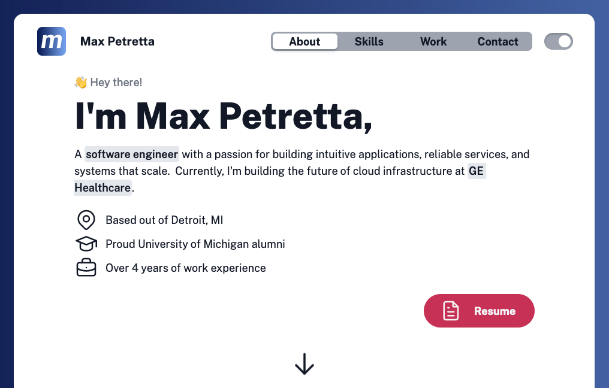
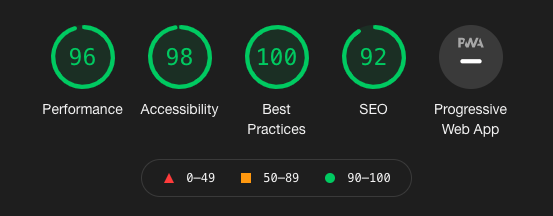

# maxpetretta.com

[](https://maxpetretta.com)

This repo contains the source code for my website, which serves as both a [portfolio](https://maxpetretta.com/) and a [blog](https://maxpetretta.com/blog).  A detailed writeup of how I built this can be found in this [blog post](https://maxpetretta.com/blog/tech-stack).

## Installation
To test this site locally, you can run the following:
```
git clone https://github.com/maxpetretta/maxpetretta.com
cd maxpetretta.com
npm install
npm run dev
open http://localhost:3000
```

## Tech Stack
Built with the following technologies:
* [Next.js](https://nextjs.org/): Static site builds and routing
* [Tailwind](https://tailwindcss.com/): Adaptive CSS page styling
* [MDX](https://mdxjs.com/): Parsing markdown files to post content
* [Shiki](https://shiki.matsu.io/): VSCode syntax highlighting for the web
* [Vercel](https://vercel.com/): Web hosting and automated deployments

## Performance


Thanks to the [JAMStack architecture](https://jamstack.org/), this site's performance is _blazing fast_ 🚀

## Contributions
PRs are always welcome, please tag me when you're ready for merge.
